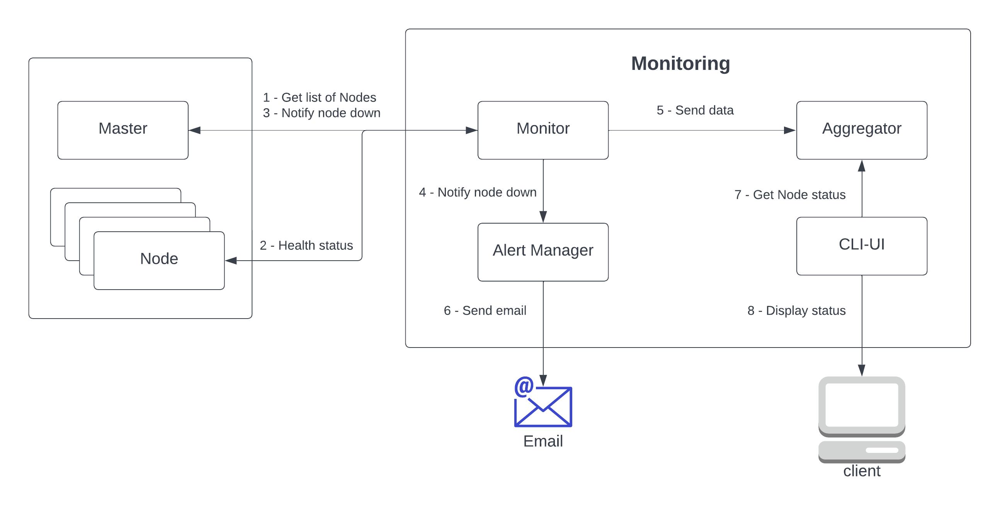

## Team members: 

* AJ 
* Aniket
* Aomkar
* Jayanth 
* Sandesh Gupta - 015649036 

## Architecture diagram

  


## How to run

1. Install and configure python3
2. Install required packages ``` pip install -r requirements.txt```
3. Clone the repository
4. Open new terminal and navigate to the folder `sentinel-monitoring-2/aggregator`
5. Start aggregator using the following command
``` python3 aggregator_server.py ```
6. Open new terminal and navigate to the folder `sentinel-monitoring-2/alert-manager`
7. Start alert-manager using the following command
``` python3 alert_manager_server.py ```
8. Open new terminal and navigate to the folder `sentinel-monitoring-2/monitor`
9. Start monitor using the following command
``` python3 monitor.py ```
10. Open new terminal and navigate to the folder `sentinel-monitoring-2/cli-ui`
11. Start aggregator using the following command
``` python3 ui.py ```